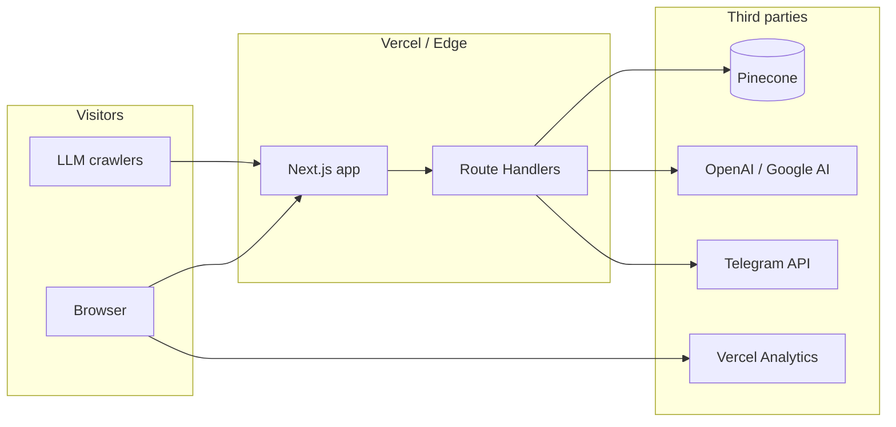

# Architecture

**Scope:** PortfolioV2 — Next.js App Router application with optional RAG backends.  
**Version:** 1.0 · **Date:** 2026-04-12  

---

## 1. Context

**Narrative:** The browser consumes mostly **static and server-rendered** React from Next.js. **Mutations and AI** run in **Route Handlers** on the server. **Embeddings and retrieval** use **Pinecone**; **generation** uses the **Vercel AI SDK** with OpenAI or Google models. Contact flows may call **Telegram**. There is **no application database** in the default stack—content lives in the repo; vectors live in Pinecone when RAG is enabled.

---

## 2. Logical components

| Layer | Responsibility | Primary location |
|-------|----------------|------------------|
| **Pages & layout** | Routes, composition, SEO metadata | `src/app/` |
| **Features** | Section UI (home, projects, shell) | `src/features/` |
| **Content** | Copy, structured portfolio data | `src/content/` |
| **RAG** | Chunking, embeddings, Pinecone I/O, chat orchestration | `src/lib/rag/` |
| **API routes** | HTTP contracts, validation, rate limits | `src/app/api/` |
| **Cross-cutting** | SEO helpers, rate limiting, monitoring | `src/lib/` |

---

## 3. Request flows

### 3.1 Page view (typical)

1. Request hits Next.js for a route (`/`, `/about`, `/projects/...`).
2. React Server Components render where possible; client components hydrate for animation/interaction.
3. Assets (fonts, images) follow Next.js optimization settings (`next.config.ts`).

### 3.2 RAG chat (simplified)

1. Client or tool `POST /api/rag/chat` with question + namespace.
2. Server embeds query (or uses retrieval step per `service.ts`), queries Pinecone `topK` matches.
3. Model streams a completion conditioned on retrieved chunks (Vercel AI SDK).
4. Response streams to client; errors return structured HTTP status.

### 3.3 Contact

1. `POST /api/contact/telegram` with form payload.
2. Validation + spam heuristics + IP rate limit.
3. Outbound call to Telegram; user receives success/failure without internal details.

---

## 4. Technology map

| Concern | Choice | Notes |
|---------|--------|------|
| Framework | Next.js 16 (App Router) | Server Components, Route Handlers, streaming |
| Language | TypeScript | Strict typing across app and `lib` |
| Styling | Tailwind CSS v4 | Utility-first, PostCSS pipeline |
| AI orchestration | Vercel AI SDK (`ai`) | `streamText`, `embed` / `embedMany` |
| Vectors | Pinecone (`@pinecone-database/pinecone`) | Namespaces for isolation (e.g. `portfolio`) |
| Package manager | Bun | `packageManager` in `package.json` |
| Hosting | Vercel (assumed) | Fits Next.js + Analytics |

---

## 5. Security and operations

- **Secrets:** `PINECONE_*`, `OPENAI_API_KEY`, `GOOGLE_GENERATIVE_AI_API_KEY` / `GEMINI_API_KEY`, Telegram tokens — **server-only**, never exposed in client bundles.
- **Rate limiting:** Applied on sensitive routes (contact, RAG read paths) using in-memory or project-specific helpers; tune for serverless multi-instance behavior if needed.
- **Abuse:** Contact route uses keyword blocks and length limits; extend via env configuration where supported.
- **Observability:** Heartbeat/alert routes support external uptime checks; pair with Vercel logs and analytics for full picture.

---

## 6. Failure modes

| Failure | Expected behavior |
|---------|-------------------|
| Pinecone unavailable | RAG routes return error response; site pages still serve. |
| LLM provider error | Chat fails gracefully; user sees error, no partial secret leakage. |
| Telegram down | Contact returns 5xx or structured error; user can retry. |

---

## 7. Related decisions

See [ADR README](./adr/README.md) for recorded decisions (RAG stack, API boundaries).

---

## 8. Future extensions (not committed)

- Protected admin for RAG ingest.
- Persistent chat history with a real database.
- i18n routes or content layer (e.g. headless CMS) if editorial velocity demands it.
